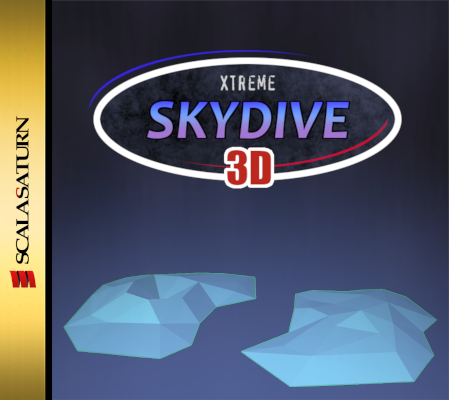

# Xtreme Skydive 3D

Game developed for the [32BitJam: SummerDreams](https://itch.io/jam/32bitjam-summer-dreams).

## How to play

Catch as many rings as possible while falling and land on the goal.
The next ring is always marked as gold.

The parachute automatically opens when the height reaches 100.

Rings are worth 100 points, landing safely is worth 500 points in morning levels and 1000 points in afternoon levels.

**You only advance to the next level if you get at least a C rank!** (50 % of the total level score).

### Controls

- **Enter**: Advance on menus
- **Left/Right Arrows**: Rotate
- **Up Arrow**: Move forward (when the parachute is closed)

### Settings

- **Alt + Enter**: Toggle fullscreen
- **Alt + S**: Toggle scanlines

## Inspiration

The game was heavily inspired by [Sky Diver](https://www.longsteve.com/fixmybugs/games-ive-coded-sky-diver/) for Nokia S30/S40 phones.

## Attribution

- [Bizcat font](https://robey.lag.net/2020/02/09/bizcat-bitmap-font.html) by [Robey](https://robey.lag.net/)
- [Cannon T50 shutter sound](https://commons.wikimedia.org/wiki/File:Canon_T50_shutter_noise.ogg) by [François Collard](https://commons.wikimedia.org/wiki/User:Francois_C)
- Coin Jingle sound by [Kenney](https://www.kenney.nl/)
- "Summer Dreams" logo by [dangergoose](https://danger-goose.itch.io/)
- 32 Bit Jam startup theme by [astrodesert](https://itch.io/profile/astrodesert)
